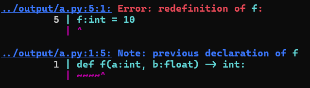

# ParselTongue: Translating to a Python's Language

## Introduction: Speaking to a Serpent

In the magical world of Harry Potter, snakes possess the ability to communicate using ParselTongue, a language characterized by its hissing sounds. This skill is considered rare and is typically passed down through generations, known as a hereditary trait. Harry Potter, the famous wizard, had the unique ability to understand and speak ParselTongue. 

But only very few of us have this ability to understand a serpent's language. Do we all need to learn ParselTongue to talk to serpents? The answer to this question cannot be a yes. While some of us could learn ParselTongue, others could be helped by these ParselTongue learners, in translating their message. But who would make the first move to learn ParselTongue? 

Here we come to help you, and provide you with the magical powers to talk to serpents, atleast Python, if not all. On gaining this magical power, you would feel that you are speaking your everyday language, and on your behalf, we would translate your daily language to the ParselTongue, the language of serpents.

The analogy becomes clearer if you consider your daily language to be Python and ParselTongue, the languages of serpents, to be the x86-64 assembly code. It is much easier for us to program in a high level language like Python, but it would be tremendous amount of work to program directly in assembly. Therefore we have built a compiler specifically for a subset of Python 3.12 

## Milestones: Building the superpower for you

We aim to build the translator in three phases as below:

- [x] [Milestone 1: From Python to Abstract Syntax Tree](https://git.cse.iitk.ac.in/divyanshc/python-compiler/-/tree/main/milestone1)
In this milestone, we constructed a scanner and a parser for a statically typed subset of the Python language. The output of the compiler is a graphical representation of the abstract syntax tree of the input program. 

- [x] [Milestone 2: From Abstract Syntax Tree to 3AC IR]()
 In this milestone, we generated 3AC IR for the input source program and add runtime support for making function calls. We also
(i) implemented support for the symbol table
(ii) perform semantic analysis to do limited error checking on types and function signatures. 

- [x] [Milestone 3: From 3AC IR to x86-64]()
In this milestone, we generated the correct x86_64 assembly from the 3AC which can be run via GAS on Linux.

## Roadmap: How we built?

1. Formulated the patterns for converting lexemes into tokens and built a lexer
2. Modifed the [grammar of Python 3.12](https://docs.python.org/3/reference/grammar.html) for the required statically typed subset of Python.
3. Removed all the shift-reduce and reduce-reduce conflicts int grammar to use the Bison-LALR parser.
4. Interfaced the lexer and parser and added semantic actions to the lexer to return appropriate tokens to the parser.
5. Developed another lexer to add semantic actions to the parser directly to generate the parse tree.
6. Cleaned up the parse tree in a systematic way to build an abstrct syntax tree (AST) out of it.
7. Generated DOT code from the AST and visualized the AST.
8. Traversed the AST to generate symbol tables and do type checking simultaneously
9. Traversed the parse tree to generate the three address code as an intermediate representation
10. Generated the x86-code from the linear 3AC using strategy similar to bottom up register allocation based on variable usage,i.e., we spill the variable whose use is the farthest in the future

## Installation and Prerequisites: How do you acquire the superpower

To acquire the superpower for speaking to serpents, you must have the following pre-requisites installed:

1. Bison: Install using the following command 
     ```sudo apt-get install bison```
2. Flex: Install using the following command
    ```sudo apt-get install flex```
3. Graphviz: Install using the following command
   ```sudo apt-get install graphviz```
4. ParselTongue: Get the superpower by cloning the repository
```git clone https://git.cse.iitk.ac.in/divyanshc/python-compiler```


## Usage: Using the superpower
The source files for milestone 3 are all inside the directory milestone3/src. A bash wrapper ```ParselTongue.sh``` is provided for compilation and execution. This wrapper uses the Makefile for compilation and also refactors command line arguments for the main compiler.
The options provided are as follows:

* ```-h``` or ```--help``` : Shows a manual for usage of compiler
* ```-i``` or ```--input``` : One can specify multiple input Python files for compiler
* ```-o``` or ```--output``` : One can specify multiple output TAC files for compiler
* ```-v``` or ```--verbose``` : This will return a .debug file which contains the infomation of parsing such as stack and tokens.
* ```-p``` or ```--ptree``` : One can specify this option to have a parse tree pdf file at the output folder
* ```-a``` or ```--ast``` : One can specify this option to have a abstract syntax tree pdf file at the output folder
* ```-d``` or ```--dot``` : This option is supposed to be used with $-a$ or $-p$. It helps retain the dot file which was used to create the pdfs.
* ```-c``` or ```--csv``` : This option need not be passed for this milestone to get the csv dump of symbol tables but will be needed for future milestone. Passing this currently wont change any behavior.
* ```-m``` or ```--markdown``` : Passing this option will output a markdown file for the symbol table dump which can be used along with an extension for better visualization of the dump. The default csv dump will also be given in this case.
* ```-t``` or ```--tac``` : Passing this option will output 3AC code file.

## Execution Examples

Inside ```milestone3/src``` :

* ```./ParselTongue.sh {input_file_1}.py {input_file_2}.py}```
* ```./ParselTongue.sh -i {input_file}.py}```
* ```./ParselTongue.sh -i {input_file}.py -o {output_file}.s}```
* ```./ParselTongue.sh -v -i {input_file}.py -o {output_file}.s}```
* ```./ParselTongue.sh {input_file_1}.py {input_file_2} -o {output_file}.s}```
* ```./ParselTongue.sh -a -m {input_file_1}.py {input_file_2}.py}```
* ```./ParselTongue.sh -a -p -v {input_file_1}.py {input_file_2}.py}```
* ```./ParselTongue.sh {input_file_1}.py -vampit {input_file_2}.py -o {output_file}.s}```

Parsel Tongue will make new output file with the help of input files if there are not enough output files. All the files specified before ```-o``` are by default taken as input files. If an input file is not found in the specified-path, then the script looks for ```../tests/specified-path``` and takes the input file from there if it exists. 
Options can be passed together if needed as in above, -vampit means verbose, ast, markdown, ptree, input, 3AC options options. ParselTongue will make new output file with the help of input files if there are not enough output files. All the files specified before -o are by default taken as input files.

## Language Features Supported:

1. Primitive data types (e.g., int, float, str, and bool)
2. 1D list (ignore dictionaries, tuples, and sets)
3. Basic operators:
    * Arithmetic operators: +, -, *, /, //, %, **
    * Relational operators: ==, !=, >, <, >=, <=
    * Logical operators: and, or, not
    * Bitwise operators: &, |, ˆ, ˜, <<, >>
    * Assignment operators: =, +=, -=, *=, /=, //=, %=, **=, &=, |=, ˆ=, «=, »=
4. Control flow via if-elif-else, for, while, break and continue (ignoring pass, do-while and
switch)
5. Support for recursion
6. Support the library function print() for only printing the primitive Python types, one at a time
7. Support for classes and objects, including multilevel inheritance and constructors. (ignoring multiple inheritance, i.e., a class can have only one parent class).
8. Methods and method calls, including both static and non-static methods

## Additional features supported

* Function Overloading:
In ParselTongue, we've implemented function overloading with appropriate checks, allowing multiple functions with the same name but different parameters to be defined. We implemented name mangling for this feature.

* Dynamic ```range``` and ```len``` functions:
Dynamic ```range``` and ```len``` functions are supported, variables that are evaluated at runtime can be passed as their arguments. The list data structure is modified to internally store the list's length in the first 8 bytes. This design choice ensures that the length is always readily available during list creation and access, streamlining operations that rely on this information.

* Iterating over 1D lists is supported.
* Print is supported for primitive data types as well as their 1D lists.
* Implemented run time error for list index out of bounds.
* Implemented run time error for negative exponents which may otherwise result in float values.

## Detailed Error Messages

Apart from the syntax errors, detailed error messages are provided, including error lines with row, column, and file name information. Notes are also used to indicate previous declarations or provide variable types, making it easier for end users to understand and infer from the errors. They include, but are not limited to,
* There is a use of undeclared variable
* There is redefinition of a variable
* A class attribute is used without defining it
* The type provided during declaration is not a valid type. (A class can be a valid type.)
* The left and right of an operator does not have compatible types
* The iterated object is not iterable, it is not a list
* The type was not specified for a parameter in a function definition
* One tries to use keyword as a variable name
* Class declaration is not done globally
* An overloaded function creates ambiguity
* The return type does not match the promised return type during function definition
* A return type was not specified for a function
* The lvalue for an assignment cannot be assigned a value
* An object attribute is defined in some function other than ```__init__```
* ```__init__``` function is defined somewhere other than inside the class
* The parent for a class is not a valid class
* There are two or more ```self``` in function formal parameters
* there is a mixed list, i.e., a list with with more than one different datatype
* Nested lists are defined. (Only 1D lists are allowed)
* An empty list is passed to a variable as they are not supported
* A function which is defined inside a class does not have self as a parameter
* The break and continue statements are used outside of a loop
* Return statement is used when not in function
* A variable which is not a list is dereferenced
* The list access or conditions in loop have an unsupported type of value in them

A sample error message is shown as below:



## Note
* Register Allocation:
The implementation does not spill on every other instruction but uses a strategy similar to bottom up allocation based on variable
usage i.e. we spill the variable whose use is the farthest in the future. The registers RAX, RBP, RSP, and RBX have been used as
special registers, while the rest are allocated and spilled across basic blocks. In a function call, arguments numbered from 1-6
are filled in the registers RDI, RSI, RDX, RCX, R8, and R9 and remaining arguments (if any) are pushed onto the stack.

* Bool Handling: 
Bools in ParselTongue are set to 1 and 0 for True and False respectively. When there is an evaluation over booleans, python converts the variable to integer. But in our implementation bools will be type-casted again after the expression evaluation to a bool.
* Divisions: 
When division operation is performed in python, the variables are converted to float. But in our implementation, the left hand side is assigned the quotient. If the left hand side is a bool then the quotient is type-casted to bool and then assigned.
* Floats: 
Floats are neglected in x86 implementation, so one won’t receive any error upon usage of floats and the behavior will be undefined.
* if \_\_name\_\_ == "\_\_main\_\_" block: 
Don’t define or declare any variable in this block. One can still call multiple functions inside this block but not declare a variable as the behavior is undefined.
* Modifications To 3AC from milestone 2: 
Introduced special commands to implement string comparison, string copy